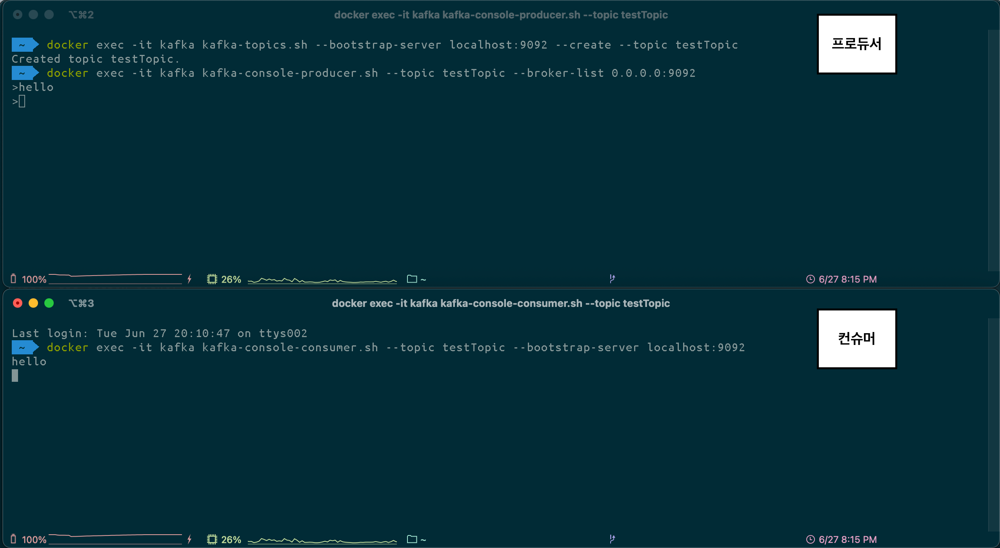

# 🧸 Redis 및 Kafka를 활용한 쿠폰 선착순 발급 이벤트 시스템

## 요구사항

선착순 `100명`에게 할인쿠폰을 제공하는 이벤트를 진행하고자 한다.

- 선착순 `100명`에게만 지급되어야 한다.
- `101개` 이상이 지급되면 안된다.
- 순각적으로 몰리는 트래픽을 버틸 수 있어야 한다.

<br>

## 퀵 스타트

### 도커 설치

```shell
brew install docker
brew link docker

docker version
```

<br>

### 도커 MySQL 실행 명령어

```shell
docker pull mysql
docker run -d -p 3306:3306 -e MYSQL_ROOT_PASSWORD=1234 --name mysql mysql
docker ps

-- mysql 접속
docker exec -it mysql bash
```

<br>

### MySQL 데이터 베이스 생성 명령어

```shell
mysql -u root -p
create database coupon_event;
use coupon_event;
```

<br>

### 도커 Redis 실행 명령어

```shell
docker pull redis
docker run --name myredis -d -p 6379:6379 redis
docker ps

-- 레디스 cli 접속
docker exec -it f8f990128b53(Redis 컨테이너 아이디) redis-cli
INCR coupon_count (숫자를 1씩 증가시키고, 증가된 값을 반환)
flushall (데이터 초기화)
```

<br>

## Kafka 얕게 알아보기

#### 카프카는 분산 이벤트 스트리밍 플랫폼입니다.

#### 이벤트 스트리밍이란 소스에서 목적지까지 이벤트를 실시간으로 스트리밍 하는 것을 뜻합니다.

### 도커 Kafka 실행 명령어

프로젝트에 `docker-compose.yml` 파일이 존재합니다.

```shell
docker-compose up -d
```

### 토픽생성

```shell
docker exec -it kafka kafka-topics.sh --bootstrap-server localhost:9092 --create --topic testTopic
```

### 프로듀서 실행

```shell
docker exec -it kafka kafka-console-producer.sh --topic testTopic --broker-list 0.0.0.0:9092
```

### 컨슈머 실행

```shell
docker exec -it kafka kafka-console-consumer.sh --topic testTopic --bootstrap-server localhost:9092
```



<br>

### 테스트를 위한 coupon_create Topic 생성
```shell
docker exec -it kafka kafka-topics.sh --bootstrap-server localhost:9092 --create --topic coupon_create
```

### coupon_create Topic의 데이터를 받아볼 Consumer 실행
```shell
docker exec -it kafka kafka-console-consumer.sh --topic coupon_create --bootstrap-server localhost:9092 --key-deserializer "org.apache.kafka.common.serialization.StringDeserializer" --value-deserializer "org.apache.kafka.common.serialization.LongDeserializer"
```